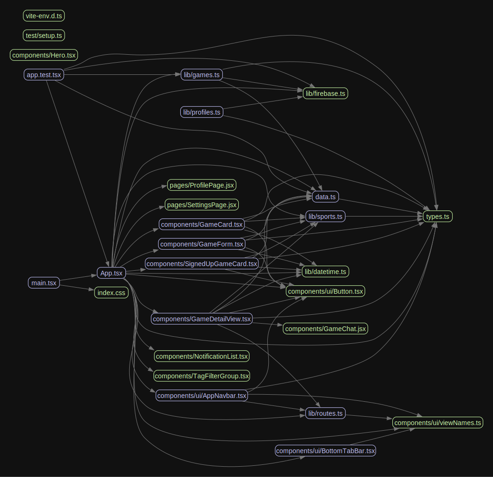

# Architecture & Code Quality Review

**Team:** Jack Press, Fay Ma, Abby Miggiani, Damini Iyer, Souvenir TURINUMUGISHA
**Date:** 4/27/2026
**Commit reviewed:** [<git sha>](https://github.com/NUCS394-S2026-2/Sports-Finder/tree/main)

## Architecture diagram

### Surprises & observations
- <thing that surprised you while drawing>
- <pattern that only became visible once drawn>

### Diagram vs. reality (top 3 mismatches from madge)
1. Profile and settings page are not pulling from the data sources we thought they were
2. ...
3. ...

### Bus factor overlay
Annotated diagram: `docs/architecture-bus-factor.png`

- Pink files (concentrated ownership): 24
- Pink files that are also hotspots (large or frequently edited): index.css
- Pink files that are also architectural centers (many other files import them): datetime.ts, Button.tsx

Biggest single-person dependency: If Abby leaves we won't understand how several .ts and .tsx files are used

## Top 5 findings

| # | Finding | File(s) | Severity | Bus factor | Why it matters |
|---|---------|---------|----------|------------|----------------|
| 1 | ... | ... | High | 1 (85% one author) | ... |
| 2 | ... | ... | ... | ... | ... |

## Tool output summary
- jscpd: 4, 14
- madge: 0, App.tsx
- Largest files: <list top 3 with line counts> App.tsx, 
- Unused exports: <count>

## What we'd fix first, and why
Our data and how it is structured. While all of the data is accessible and usable, It is stored in ineffiecent and confusing ways

## Lessons for the next project
Each phrased as "Next time, we will ___":

1. Next time we will Properly plan out all necessary and potential components(i.e. systems, pages, data structures, etc)
2. Next time we will sketch the archicture diagram of the app before starting the development and update it as we go to keep things organized.
3. 
